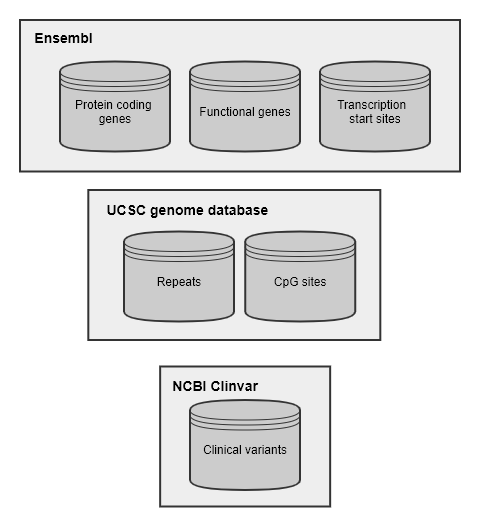

```{r setup, include=FALSE}
knitr::opts_chunk$set(echo=TRUE)
knitr::opts_knit$set(progress=FALSE, verbose=FALSE)
```

# Introduction
  RIPAT is an R package for Retroviral vector integration site analysis. This package is developed to
  find integration regions on the target sequence and study biological meaning of the integration 
  pattern such as distance from important genomic factors and genomic features.  
  It's distributed from our Github repository (https://github.com/bioinfo16/RIPAT) and Bioconductor.  

# Dependencies  
  RIPAT will be run on all R versions but, we strongly recommend that user install the R version
  3.5.3 or higher. Plus, RIPAT needs these packages below to run. By the install command (writted
  below), RIPAT install all packages automatically. If user already install some of packages listed
  up, RIPAT will be reinstall proper version of these packages itself.  
  

Package    | Version  
---------- | ----------  
GenomicRanges | >= 1.34.4  
ggplot2    | >= 3.1.0  
grDevices | >= 3.5.3  
karyoploteR | >= 1.6.3  
openxlsx | >= 4.1.4  
plyr | >= 1.8.4  
RColorBrewer | >= 1.1-2  
regioneR | >= 1.12.0  
stats | >= 3.5.3  
stringr | >=1.3.1  
utils | >= 3.5.3  
biomaRt | >= 2.38.0  
rtracklayer | >= 1.42.2

# Installation
  We strongly recommand the way using __*devtools*__ package in R.  
  But, you can download this package as zip-file format from our github repository.  
  Plus, we will upload this package to Bioconductor repository. It's in progress.  
  
  - Bioconductor __*(Recommended)*__  
  
    ```
      if (!requireNamespace("BiocManager", quietly = TRUE))
          install.packages("BiocManager")
      BiocManager::install("RIPAT")  
    ```  
  
  - By devtools R package  
  ```
  devtools::install_github("bioinfo16/RIPAT")
  ```  
  
  - Or, download it through the menu *releases* and enter the following command in the console.
    But, this way doesn't install package which is needed for running __RIPAT__.
  ```
  R CMD INSTALL [PACKAGE_DOWNLOAD_PATH]
  ```  

# Databases  
RIPAT provides four types of site annotation analysis, Gene, CpG site, Repeat and pathogenic variant.
This R package uses Ensembl database, UCSC genome database and NCBI ClinVar in site annotation. Ensembl database is used to gene annotation. UCSC genome database is needed to annotation by gene, CpG site and repeat sequence. Pathogenic variant annotation uses from NCBI Clinvar database. This package can annotate integration sites on the human genome only. Avaliable target version is GRCh37 and GRCh38.  
``` {R echo=FALSE, out.width='70%', fig.align='center'}
    
```

# Input format
  RIPAT can do integration pattern analysis with local alignment tools such as BLAST and BLAT. Each of cases makes the tab-delimited result file. Specific format for RIPAT is depicted to the table below.  
``` {R echo=FALSE, fig.align='left'}
    knitr::include_graphics('input_contents_table.png')
```

# Functions
In this manual, Gene and CpG annotation is written as a example.  
Other annotation function is working same with both cases.  

+ makeData
RIPAT provides the function that download genomic data files. When user enters target genome version to this function, all data are downloaded automatically.
    ``` {R results='hide', message=FALSE}
    library(RIPAT)
    # Download gene data file
    makeData(organism = 'GRCh37', dataType = 'gene')
    ```

+ makeInputObj  
Annotation funcions in this package need specific format of inputs.
So, this function converts raw local alignment result to R object with the avaliable format. 
User can use BLAST(output format 6 in command line version) and BLAT output format specifically.

    ``` {R results='hide', message=FALSE}
    blast_obj=makeInputObj(inFile='blast_result.txt',  
                           vectorPos='front',
                           mapTool='blast',  
                           outPath='.',  
                           outFileName='A5_15856M_BLAST')
    ```

+ annoByGene  
This function uses Gene and TSS data from Ensembl to check the feature of integration regions.
User can get site information inserted within genes and distribution from gene and TSS coordinations.
Plus, user can do random distribution analysis by this function.

1. With random integration site analysis
    ``` {R results='hide', message=FALSE}
    blast_gene10K=annoByGene(hits=blast_obj,
                             organism='GRCh37',  
                             interval=5000,
                             range=c(-20000, 20000),  
                             doRandom=TRUE,
                             randomSize=10000,  
                             includeUndecided=FALSE,  
                             outPath='.',
                             outFileName='A5_15856M_BLAST_10K')
    ```  

**[ Integration site distribution from Genes ]**  
``` {R echo=FALSE}
    knitr::include_graphics('A5_15856M_BLAST_10K_distribution_gene_GRCh37.png')
```

**[ Integration site distribution from transcription start site (TSS) ]**  
``` {R echo=FALSE}
    knitr::include_graphics('A5_15856M_BLAST_10K_distribution_tss_GRCh37.png')
```

2. Without random integration site analysis
    ``` {R results='hide', message=FALSE}
    blast_gene_norandom=annoByGene(hits=blast_obj, 
                                   organism='GRCh37',  
                                   interval=5000, 
                                   range=c(-20000, 20000),  
                                   doRandom=FALSE,  
                                   includeUndecided=FALSE,  
                                   outPath='.',
                                   outFileName='A5_15856M_BLAST_norandom')  
    ```

**[ Integration site distribution from Genes ]**  
``` {R echo=FALSE}
    knitr::include_graphics('A5_15856M_BLAST_norandom_distribution_gene_GRCh37.png')
```
    
**[ Integration site distribution from transcription start site (TSS) ]**  
``` {R echo=FALSE}
    knitr::include_graphics('A5_15856M_BLAST_norandom_distribution_tss_GRCh37.png')
```
  
+ drawingKaryo  
To see the retroviral vector integration site at glance, we procide the karyoplot with integration mark.
    ``` {R results='hide', message=FALSE}
    ## Karyogram marked genomic spots
    karyo_obj_gene = drawingKaryo(hits=blast_obj, 
                                  organism="GRCh37",  
                                  feature=blast_gene10K$Gene_data,  
                                  includeUndecided=FALSE,  
                                  outPath=getwd(),  
                                  outFileName='A5_15856M_BLAST_karyo_gene')  
    
    ## Karyogram marked CpG sites
    karyo_obj_cpg = drawingKaryo(hits=blast_obj,
                                 organism="GRCh37",
                                 feature=blast_cpg_10K$CpG_data,
                                 includeUndecided=FALSE,
                                 outPath=getwd(),
                                 outFileName='A5_15856M_BLAST_karyo_cpg')
    ```  
    
**[ Integration sites marked with genes ]**  
``` {R echo=FALSE}
    knitr::include_graphics('Ideogram_A5_15856M_BLAST_karyo_gene_GRCh37_decided.png')
```
    
+ makeDocument  
RIPAT rearrange the result of each annotation function. This function is for users who are not familar to deal R for RIPAT. This function makes two documents about exprimental(observed) data and random set data. In addition, it show the histogram to see the distribution from featres and draw a p-value plot by p-value to see the result of randoma set analysis at glance.  
    ``` {R results='hide', message=FALSE}
    makeDocument(res = blast_gene10K, 
                 resType = 'gene',
                 interval = 5000,
                 range = c(-20000, 20000),
                 outPath = getwd(),
                 includeUndecided = FALSE,
                 outFileName = 'A5_15856M_BLAST_10K')  
    ```  

**[ Histogram of experimental data ]**  
``` {R echo=FALSE}
    knitr::include_graphics('A5_15856M_BLAST_10K_histogram_observed.png')
```    

**[ Histogram of random data ]**  
``` {R echo=FALSE}
    knitr::include_graphics('A5_15856M_BLAST_10K_histogram_random.png')
```
  
In p-value plot, full-colored circle means significant difference between exprimental data and random data (p-value <= 0.05). Circle size is p-value transformation score for visualization.  

**[ P-value plot ]**  
``` {R echo=FALSE}
    knitr::include_graphics('A5_15856M_BLAST_10K_pvalue_plot.png')
```

# Session information
Example codes in this vignette was run under the following conditions:
```
R version 3.5.3 (2019-03-11)
Platform: x86_64-w64-mingw32/x64 (64-bit)
Running under: Windows >= 8 x64 (build 9200)

Matrix products: default

locale:
[1] LC_COLLATE=Korean_Korea.949  LC_CTYPE=Korean_Korea.949    
[3] LC_MONETARY=Korean_Korea.949 LC_NUMERIC=C                 
[5] LC_TIME=Korean_Korea.949    

attached base packages:
[1] parallel  stats4    stats     
[4] graphics  grDevices utils     
[7] datasets  methods  base     

other attached packages:
 [1] GenomicRanges_1.34.0        GenomeInfoDb_1.18.2           IRanges_2.16.0
 [4] RIPAT_0.99.0    S4Vectors_0.20.1      BiocGenerics_0.28.0        

loaded via a namespace (and not attached):
  [1] colorspace_1.4-1            ellipsis_0.3.0              
  [3] rprojroot_1.3-2             biovizBase_1.30.1
  [5] htmlTable_1.13.3            XVector_0.22.0             
  [7] base64enc_0.1-3             fs_1.3.1                    
  [9] dichromat_2.0-0             rstudioapi_0.11             
  [11] remotes_2.1.1              bit64_0.9-7                
  [13] AnnotationDbi_1.44.0       fansi_0.4.1                 
  [15] splines_3.5.3               knitr_1.28                  
  [17] pkgload_1.0.2               Formula_1.2-3              
  [19] Rsamtools_1.34.1            cluster_2.0.7-1
  [21] BiocManager_1.30.10         compiler_3.5.3  
 (...skipped...)
``` 

# Citation
If you want to use RIPAT in your work, write it in your publications:
```{r echo=FALSE}
citation('RIPAT')
```

# References
+ Appelt, J. U., et al. "QuickMap: a public tool for large-scale gene therapy vector insertion site mapping and analysis." Gene therapy 16.7 (2009): 885-893.  
+ Boratyn, Grzegorz M., et al. "BLAST: a more efficient report with usability improvements." Nucleic acids research 41.W1 (2013): W29-W33.  
+ Demeulemeester, Jonas, et al. "Retroviral integration: site matters: mechanisms and consequences of retroviral integration site selection." Bioessays 37.11 (2015): 1202-1214.   
+ Haeussler, Maximilian, et al. "The UCSC genome browser database: 2019 update." Nucleic acids research 47.D1 (2019): D853-D858.  
+ Hocum, Jonah D., et al. "VISA-Vector Integration Site Analysis server: a web-based server to rapidly identify retroviral integration sites from next-generation sequencing." BMC bioinformatics 16.1 (2015): 212.  
+ Kasprzyk, Arek. "BioMart: driving a paradigm change in biological data management." Database 2011 (2011).  
+ Kent, W. James. "BLAT-the BLAST-like alignment tool." Genome research 12.4 (2002): 656-664.  
+ Landrum, Melissa J., et al. "ClinVar: public archive of interpretations of clinically relevant variants." Nucleic acids research 44.D1 (2016): D862-D868.  
+ Lawrence, Michael, et al. "Software for computing and annotating genomic ranges." PLoS computational biology 9.8 (2013).  
+ Lewinski, Mary K., et al. "Retroviral DNA integration: viral and cellular determinants of target-site selection." PLoS pathogens 2.6 (2006).  
+ Mitchell, Rick S., et al. "Retroviral DNA integration: ASLV, HIV, and MLV show distinct target site preferences." PLoS biology 2.8 (2004).  
+ Sherman, Eric, et al. "INSPIIRED: a pipeline for quantitative analysis of sites of new DNA integration in cellular genomes." Molecular Therapy-Methods & Clinical Development 4 (2017): 39-49.  
+ Waehler, Reinhard, Stephen J. Russell, and David T. Curiel. "Engineering targeted viral vectors for gene therapy." Nature reviews genetics 8.8 (2007): 573-587.  


